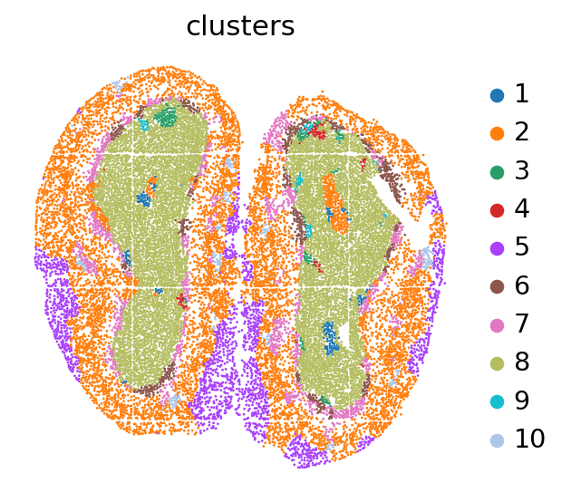

Tutorial 3: Slide-seq or Stereo-seq dataset
===========================================

In this tutorial, we show how to apply DenoiseST to identify spatial domains on Slide-seq or Stereo-seq. As a example, we analyse the Stereo dataset
^^^^^^^^^^^^^^^^^^^^^^^^^^^^^^^^^^^^^^^^^^^^^^^^^^^^^^^^^^^^^^^^^^^^^^^^^^^^^^^^^^^^^^^^^^^^^^^^^^^^^^^^^^^^^^^^^^^^^^^^^^^^^^^^^^^^^^^^^^^^^^^^^^^^

The source code package is freely available at https://github.com/cuiyaxuan/DenoiseST/tree/master. The datasets used in this study can be found at https://drive.google.com/drive/folders/1H-ymfCqlDR1wpMRX-bCewAjG5nOrIF51?usp=sharing. The details of data description are shown in Supplementary Note S1.
^^^^^^^^^^^^^^^^^^^^^^^^^^^^^^^^^^^^^^^^^^^^^^^^^^^^^^^^^^^^^^^^^^^^^^^^^^^^^^^^^^^^^^^^^^^^^^^^^^^^^^^^^^^^^^^^^^^^^^^^^^^^^^^^^^^^^^^^^^^^^^^^^^^^^^^^^^^^^^^^^^^^^^^^^^^^^^^^^^^^^^^^^^^^^^^^^^^^^^^^^^^^^^^^^^^^^^^^^^^^^^^^^^^^^^^^^^^^^^^^^^^^^^^^^^^^^^^^^^^^^^^^^^^^^^^^^^^^^^^^^^^^^^^^^^^^^^^^^^^^

.. code:: ipython3

    from DenoiseST import DenoiseST
    import os
    import torch
    import pandas as pd
    import scanpy as sc
    from sklearn import metrics
    import multiprocessing as mp
    
    def setup_seed(seed=41):
        import torch
        import os
        import numpy as np
        import random
        torch.manual_seed(seed)  
        np.random.seed(seed)  # Numpy module.
        random.seed(seed)  # Python random module.
        if torch.cuda.is_available():
            # torch.backends.cudnn.benchmark = False
            torch.backends.cudnn.deterministic = True
            torch.cuda.manual_seed(seed)  
            torch.cuda.manual_seed_all(seed) 
            #os.environ['PYTHONHASHSEED'] = str(seed)
    
    setup_seed(41)
    
    device = torch.device('cuda:0' if torch.cuda.is_available() else 'cpu')
    
    
    n_clusters = 10  ###### the number of spatial domains.
    file_path = '/home/cuiyaxuan/spatialLIBD/5.Mouse_Olfactory/' #please replace 'file_path' with the download path
    adata = sc.read_h5ad(file_path + 'filtered_feature_bc_matrix.h5ad') #### project name
    adata.var_names_make_unique()
    model = DenoiseST(adata,datatype='Slide',device=device,n_top_genes=4000)
    adata = model.train()
    radius = 50
    tool = 'mclust' # mclust, leiden, and louvain
    from utils import clustering
    
    if tool == 'mclust':
       clustering(adata, n_clusters, radius=radius, method=tool, refinement=True)
    elif tool in ['leiden', 'louvain']:
       clustering(adata, n_clusters, radius=radius, method=tool, start=0.1, end=2.0, increment=0.01, refinement=False)
    
    adata.obs['domain']
    adata.obs['domain'].to_csv("label.csv")

.. parsed-literal::

    /home/cuiyaxuan/anaconda3/envs/pytorch/lib/python3.8/site-packages/scanpy/preprocessing/_highly_variable_genes.py:62: UserWarning: `flavor='seurat_v3'` expects raw count data, but non-integers were found.
      warnings.warn(

.. parsed-literal::

    Graph constructed!
    Building sparse matrix ...
    Begin to train ST data...

.. parsed-literal::

      0%|                                                   | 0/500 [00:00<?, ?it/s]

.. parsed-literal::

    0

.. parsed-literal::

      0%|                                           | 1/500 [00:00<04:24,  1.89it/s]

.. parsed-literal::

    0

.. parsed-literal::

      0%|▏                                          | 2/500 [00:00<04:01,  2.07it/s]

.. parsed-literal::

    0

.. parsed-literal::

      1%|▎                                          | 3/500 [00:01<03:53,  2.13it/s]

.. parsed-literal::

    0

.. parsed-literal::

      1%|▎                                          | 4/500 [00:01<03:49,  2.16it/s]

.. parsed-literal::

    0

.. parsed-literal::

      1%|▍                                          | 5/500 [00:02<03:47,  2.17it/s]

.. parsed-literal::

    0

.. parsed-literal::

      1%|▌                                          | 6/500 [00:02<03:46,  2.19it/s]

.. parsed-literal::

    0

.. parsed-literal::

      1%|▌                                          | 7/500 [00:03<03:45,  2.19it/s]

.. parsed-literal::

    0

.. parsed-literal::

      2%|▋                                          | 8/500 [00:03<03:44,  2.19it/s]

.. parsed-literal::

    0

.. parsed-literal::

      2%|▊                                          | 9/500 [00:04<03:43,  2.19it/s]

.. parsed-literal::

    0

.. parsed-literal::

      2%|▊                                         | 10/500 [00:04<03:42,  2.20it/s]

.. parsed-literal::

    0

.. parsed-literal::

      2%|▉                                         | 11/500 [00:05<03:42,  2.20it/s]

.. parsed-literal::

    0

.. parsed-literal::

      2%|█                                         | 12/500 [00:05<03:42,  2.20it/s]

.. parsed-literal::

    0

.. parsed-literal::

      3%|█                                         | 13/500 [00:05<03:41,  2.20it/s]

.. parsed-literal::

    0

.. parsed-literal::

      3%|█▏                                        | 14/500 [00:06<03:41,  2.19it/s]

.. parsed-literal::

    0

.. parsed-literal::

      3%|█▎                                        | 15/500 [00:06<03:41,  2.19it/s]

.. parsed-literal::

    0

.. parsed-literal::

      3%|█▎                                        | 16/500 [00:07<03:40,  2.19it/s]

.. parsed-literal::

    0

.. parsed-literal::

      3%|█▍                                        | 17/500 [00:07<03:40,  2.19it/s]

.. parsed-literal::

    0

.. parsed-literal::

      4%|█▌                                        | 18/500 [00:08<03:39,  2.19it/s]

.. parsed-literal::

    0

.. parsed-literal::

      4%|█▌                                        | 19/500 [00:08<03:38,  2.20it/s]

.. parsed-literal::

    0

.. parsed-literal::

      4%|█▋                                        | 20/500 [00:09<03:38,  2.20it/s]

.. parsed-literal::

    0

.. parsed-literal::

      4%|█▊                                        | 21/500 [00:09<03:38,  2.20it/s]

.. parsed-literal::

    0

.. parsed-literal::

      4%|█▊                                        | 22/500 [00:10<03:37,  2.19it/s]

.. parsed-literal::

    0

.. parsed-literal::

      5%|█▉                                        | 23/500 [00:10<03:37,  2.19it/s]

.. parsed-literal::

    0

.. parsed-literal::

      5%|██                                        | 24/500 [00:10<03:37,  2.19it/s]

.. parsed-literal::

    0

.. parsed-literal::

      5%|██                                        | 25/500 [00:11<03:36,  2.19it/s]

.. parsed-literal::

    0

.. parsed-literal::

      5%|██▏                                       | 26/500 [00:11<03:36,  2.19it/s]

.. parsed-literal::

    0

.. parsed-literal::

      5%|██▎                                       | 27/500 [00:12<03:35,  2.19it/s]

.. parsed-literal::

    0

.. parsed-literal::

      6%|██▎                                       | 28/500 [00:12<03:35,  2.19it/s]

.. parsed-literal::

    0

.. parsed-literal::

      6%|██▍                                       | 29/500 [00:13<03:35,  2.19it/s]

.. parsed-literal::

    0

.. parsed-literal::

      6%|██▌                                       | 30/500 [00:13<03:34,  2.19it/s]

.. parsed-literal::

    0

.. parsed-literal::

      6%|██▌                                       | 31/500 [00:14<03:34,  2.18it/s]

.. parsed-literal::

    0

.. parsed-literal::

      6%|██▋                                       | 32/500 [00:14<03:34,  2.19it/s]

.. parsed-literal::

    0

.. parsed-literal::

      7%|██▊                                       | 33/500 [00:15<03:33,  2.19it/s]

.. parsed-literal::

    0

.. parsed-literal::

      7%|██▊                                       | 34/500 [00:15<03:32,  2.19it/s]

.. parsed-literal::

    0

.. parsed-literal::

      7%|██▉                                       | 35/500 [00:16<03:32,  2.18it/s]

.. parsed-literal::

    0

.. parsed-literal::

      7%|███                                       | 36/500 [00:16<03:32,  2.18it/s]

.. parsed-literal::

    0

.. parsed-literal::

      7%|███                                       | 37/500 [00:16<03:32,  2.18it/s]

.. parsed-literal::

    0

.. parsed-literal::

      8%|███▏                                      | 38/500 [00:17<03:31,  2.18it/s]

.. parsed-literal::

    0

.. parsed-literal::

      8%|███▎                                      | 39/500 [00:17<03:31,  2.18it/s]

.. parsed-literal::

    0

.. parsed-literal::

      8%|███▎                                      | 40/500 [00:18<03:30,  2.19it/s]

.. parsed-literal::

    0

.. parsed-literal::

      8%|███▍                                      | 41/500 [00:18<03:30,  2.18it/s]

.. parsed-literal::

    0

.. parsed-literal::

      8%|███▌                                      | 42/500 [00:19<03:29,  2.18it/s]

.. parsed-literal::

    0

.. parsed-literal::

      9%|███▌                                      | 43/500 [00:19<03:29,  2.18it/s]

.. parsed-literal::

    0

.. parsed-literal::

      9%|███▋                                      | 44/500 [00:20<03:28,  2.19it/s]

.. parsed-literal::

    0

.. parsed-literal::

      9%|███▊                                      | 45/500 [00:20<03:28,  2.18it/s]

.. parsed-literal::

    0

.. parsed-literal::

      9%|███▊                                      | 46/500 [00:21<03:27,  2.18it/s]

.. parsed-literal::

    0

.. parsed-literal::

      9%|███▉                                      | 47/500 [00:21<03:27,  2.19it/s]

.. parsed-literal::

    0

.. parsed-literal::

     10%|████                                      | 48/500 [00:21<03:26,  2.19it/s]

.. parsed-literal::

    0

.. parsed-literal::

     10%|████                                      | 49/500 [00:22<03:26,  2.18it/s]

.. parsed-literal::

    0

.. parsed-literal::

     10%|████▏                                     | 50/500 [00:22<03:26,  2.18it/s]

.. parsed-literal::

    0

.. parsed-literal::

     10%|████▎                                     | 51/500 [00:23<03:25,  2.19it/s]

.. parsed-literal::

    0

.. parsed-literal::

     10%|████▎                                     | 52/500 [00:23<03:25,  2.18it/s]

.. parsed-literal::

    0

.. parsed-literal::

     11%|████▍                                     | 53/500 [00:24<03:24,  2.18it/s]

.. parsed-literal::

    0

.. parsed-literal::

     11%|████▌                                     | 54/500 [00:24<03:24,  2.18it/s]

.. parsed-literal::

    0

.. parsed-literal::

     11%|████▌                                     | 55/500 [00:25<03:23,  2.19it/s]

.. parsed-literal::

    0

.. parsed-literal::

     11%|████▋                                     | 56/500 [00:25<03:23,  2.19it/s]

.. parsed-literal::

    0

.. parsed-literal::

     11%|████▊                                     | 57/500 [00:26<03:22,  2.19it/s]

.. parsed-literal::

    0

.. parsed-literal::

     12%|████▊                                     | 58/500 [00:26<03:22,  2.18it/s]

.. parsed-literal::

    0

.. parsed-literal::

     12%|████▉                                     | 59/500 [00:27<03:21,  2.18it/s]

.. parsed-literal::

    0

.. parsed-literal::

     12%|█████                                     | 60/500 [00:27<03:21,  2.18it/s]

.. parsed-literal::

    0

.. parsed-literal::

     12%|█████                                     | 61/500 [00:27<03:21,  2.18it/s]

.. parsed-literal::

    0

.. parsed-literal::

     12%|█████▏                                    | 62/500 [00:28<03:20,  2.18it/s]

.. parsed-literal::

    0

.. parsed-literal::

     13%|█████▎                                    | 63/500 [00:28<03:20,  2.18it/s]

.. parsed-literal::

    0

.. parsed-literal::

     13%|█████▍                                    | 64/500 [00:29<03:19,  2.18it/s]

.. parsed-literal::

    0

.. parsed-literal::

     13%|█████▍                                    | 65/500 [00:29<03:19,  2.18it/s]

.. parsed-literal::

    0

.. parsed-literal::

     13%|█████▌                                    | 66/500 [00:30<03:18,  2.18it/s]

.. parsed-literal::

    0

.. parsed-literal::

     13%|█████▋                                    | 67/500 [00:30<03:18,  2.18it/s]

.. parsed-literal::

    0

.. parsed-literal::

     14%|█████▋                                    | 68/500 [00:31<03:17,  2.18it/s]

.. parsed-literal::

    0

.. parsed-literal::

     14%|█████▊                                    | 69/500 [00:31<03:17,  2.19it/s]

.. parsed-literal::

    0

.. parsed-literal::

     14%|█████▉                                    | 70/500 [00:32<03:16,  2.19it/s]

.. parsed-literal::

    0

.. parsed-literal::

     14%|█████▉                                    | 71/500 [00:32<03:16,  2.18it/s]

.. parsed-literal::

    0

.. parsed-literal::

     14%|██████                                    | 72/500 [00:32<03:16,  2.18it/s]

.. parsed-literal::

    0

.. parsed-literal::

     15%|██████▏                                   | 73/500 [00:33<03:15,  2.18it/s]

.. parsed-literal::

    0

.. parsed-literal::

     15%|██████▏                                   | 74/500 [00:33<03:15,  2.18it/s]

.. parsed-literal::

    0

.. parsed-literal::

     15%|██████▎                                   | 75/500 [00:34<03:14,  2.18it/s]

.. parsed-literal::

    0

.. parsed-literal::

     15%|██████▍                                   | 76/500 [00:34<03:14,  2.18it/s]

.. parsed-literal::

    0

.. parsed-literal::

     15%|██████▍                                   | 77/500 [00:35<03:13,  2.18it/s]

.. parsed-literal::

    0

.. parsed-literal::

     16%|██████▌                                   | 78/500 [00:35<03:13,  2.18it/s]

.. parsed-literal::

    0

.. parsed-literal::

     16%|██████▋                                   | 79/500 [00:36<03:13,  2.18it/s]

.. parsed-literal::

    0

.. parsed-literal::

     16%|██████▋                                   | 80/500 [00:36<03:12,  2.18it/s]

.. parsed-literal::

    0

.. parsed-literal::

     16%|██████▊                                   | 81/500 [00:37<03:12,  2.18it/s]

.. parsed-literal::

    0

.. parsed-literal::

     16%|██████▉                                   | 82/500 [00:37<03:11,  2.18it/s]

.. parsed-literal::

    0

.. parsed-literal::

     17%|██████▉                                   | 83/500 [00:38<03:11,  2.18it/s]

.. parsed-literal::

    0

.. parsed-literal::

     17%|███████                                   | 84/500 [00:38<03:10,  2.18it/s]

.. parsed-literal::

    0

.. parsed-literal::

     17%|███████▏                                  | 85/500 [00:38<03:10,  2.18it/s]

.. parsed-literal::

    0

.. parsed-literal::

     17%|███████▏                                  | 86/500 [00:39<03:09,  2.18it/s]

.. parsed-literal::

    0

.. parsed-literal::

     17%|███████▎                                  | 87/500 [00:39<03:09,  2.18it/s]

.. parsed-literal::

    0

.. parsed-literal::

     18%|███████▍                                  | 88/500 [00:40<03:08,  2.18it/s]

.. parsed-literal::

    0

.. parsed-literal::

     18%|███████▍                                  | 89/500 [00:40<03:08,  2.18it/s]

.. parsed-literal::

    0

.. parsed-literal::

     18%|███████▌                                  | 90/500 [00:41<03:08,  2.18it/s]

.. parsed-literal::

    0

.. parsed-literal::

     18%|███████▋                                  | 91/500 [00:41<03:08,  2.17it/s]

.. parsed-literal::

    0

.. parsed-literal::

     18%|███████▋                                  | 92/500 [00:42<03:07,  2.18it/s]

.. parsed-literal::

    0

.. parsed-literal::

     19%|███████▊                                  | 93/500 [00:42<03:06,  2.18it/s]

.. parsed-literal::

    0

.. parsed-literal::

     19%|███████▉                                  | 94/500 [00:43<03:06,  2.18it/s]

.. parsed-literal::

    0

.. parsed-literal::

     19%|███████▉                                  | 95/500 [00:43<03:05,  2.18it/s]

.. parsed-literal::

    0

.. parsed-literal::

     19%|████████                                  | 96/500 [00:43<03:05,  2.18it/s]

.. parsed-literal::

    0

.. parsed-literal::

     19%|████████▏                                 | 97/500 [00:44<03:04,  2.18it/s]

.. parsed-literal::

    0

.. parsed-literal::

     20%|████████▏                                 | 98/500 [00:44<03:04,  2.18it/s]

.. parsed-literal::

    0

.. parsed-literal::

     20%|████████▎                                 | 99/500 [00:45<03:03,  2.18it/s]

.. parsed-literal::

    0

.. parsed-literal::

     20%|████████▏                                | 100/500 [00:45<03:03,  2.18it/s]

.. parsed-literal::

    0

.. parsed-literal::

     20%|████████▎                                | 101/500 [00:46<03:03,  2.18it/s]

.. parsed-literal::

    0

.. parsed-literal::

     20%|████████▎                                | 102/500 [00:46<03:02,  2.18it/s]

.. parsed-literal::

    0

.. parsed-literal::

     21%|████████▍                                | 103/500 [00:47<03:02,  2.18it/s]

.. parsed-literal::

    0

.. parsed-literal::

     21%|████████▌                                | 104/500 [00:47<03:02,  2.18it/s]

.. parsed-literal::

    0

.. parsed-literal::

     21%|████████▌                                | 105/500 [00:48<03:01,  2.18it/s]

.. parsed-literal::

    0

.. parsed-literal::

     21%|████████▋                                | 106/500 [00:48<03:00,  2.18it/s]

.. parsed-literal::

    0

.. parsed-literal::

     21%|████████▊                                | 107/500 [00:49<03:00,  2.18it/s]

.. parsed-literal::

    0

.. parsed-literal::

     22%|████████▊                                | 108/500 [00:49<02:59,  2.18it/s]

.. parsed-literal::

    0

.. parsed-literal::

     22%|████████▉                                | 109/500 [00:49<02:59,  2.18it/s]

.. parsed-literal::

    0

.. parsed-literal::

     22%|█████████                                | 110/500 [00:50<02:58,  2.18it/s]

.. parsed-literal::

    0

.. parsed-literal::

     22%|█████████                                | 111/500 [00:50<02:58,  2.18it/s]

.. parsed-literal::

    0

.. parsed-literal::

     22%|█████████▏                               | 112/500 [00:51<02:57,  2.18it/s]

.. parsed-literal::

    0

.. parsed-literal::

     23%|█████████▎                               | 113/500 [00:51<02:57,  2.18it/s]

.. parsed-literal::

    0

.. parsed-literal::

     23%|█████████▎                               | 114/500 [00:52<02:56,  2.18it/s]

.. parsed-literal::

    0

.. parsed-literal::

     23%|█████████▍                               | 115/500 [00:52<02:56,  2.18it/s]

.. parsed-literal::

    0

.. parsed-literal::

     23%|█████████▌                               | 116/500 [00:53<02:56,  2.18it/s]

.. parsed-literal::

    0

.. parsed-literal::

     23%|█████████▌                               | 117/500 [00:53<02:55,  2.18it/s]

.. parsed-literal::

    0

.. parsed-literal::

     24%|█████████▋                               | 118/500 [00:54<02:55,  2.18it/s]

.. parsed-literal::

    0

.. parsed-literal::

     24%|█████████▊                               | 119/500 [00:54<02:54,  2.18it/s]

.. parsed-literal::

    0

.. parsed-literal::

     24%|█████████▊                               | 120/500 [00:54<02:54,  2.18it/s]

.. parsed-literal::

    0

.. parsed-literal::

     24%|█████████▉                               | 121/500 [00:55<02:53,  2.18it/s]

.. parsed-literal::

    0

.. parsed-literal::

     24%|██████████                               | 122/500 [00:55<02:53,  2.18it/s]

.. parsed-literal::

    0

.. parsed-literal::

     25%|██████████                               | 123/500 [00:56<02:52,  2.18it/s]

.. parsed-literal::

    0

.. parsed-literal::

     25%|██████████▏                              | 124/500 [00:56<02:52,  2.18it/s]

.. parsed-literal::

    0

.. parsed-literal::

     25%|██████████▎                              | 125/500 [00:57<02:51,  2.18it/s]

.. parsed-literal::

    0

.. parsed-literal::

     25%|██████████▎                              | 126/500 [00:57<02:51,  2.18it/s]

.. parsed-literal::

    0

.. parsed-literal::

     25%|██████████▍                              | 127/500 [00:58<02:51,  2.18it/s]

.. parsed-literal::

    0

.. parsed-literal::

     26%|██████████▍                              | 128/500 [00:58<02:50,  2.18it/s]

.. parsed-literal::

    0

.. parsed-literal::

     26%|██████████▌                              | 129/500 [00:59<02:50,  2.17it/s]

.. parsed-literal::

    0

.. parsed-literal::

     26%|██████████▋                              | 130/500 [00:59<02:50,  2.17it/s]

.. parsed-literal::

    0

.. parsed-literal::

     26%|██████████▋                              | 131/500 [01:00<02:49,  2.17it/s]

.. parsed-literal::

    0

.. parsed-literal::

     26%|██████████▊                              | 132/500 [01:00<02:49,  2.18it/s]

.. parsed-literal::

    0

.. parsed-literal::

     27%|██████████▉                              | 133/500 [01:00<02:48,  2.17it/s]

.. parsed-literal::

    0

.. parsed-literal::

     27%|██████████▉                              | 134/500 [01:01<02:48,  2.17it/s]

.. parsed-literal::

    0

.. parsed-literal::

     27%|███████████                              | 135/500 [01:01<02:47,  2.18it/s]

.. parsed-literal::

    0

.. parsed-literal::

     27%|███████████▏                             | 136/500 [01:02<02:47,  2.18it/s]

.. parsed-literal::

    0

.. parsed-literal::

     27%|███████████▏                             | 137/500 [01:02<02:46,  2.18it/s]

.. parsed-literal::

    0

.. parsed-literal::

     28%|███████████▎                             | 138/500 [01:03<02:46,  2.18it/s]

.. parsed-literal::

    0

.. parsed-literal::

     28%|███████████▍                             | 139/500 [01:03<02:45,  2.18it/s]

.. parsed-literal::

    0

.. parsed-literal::

     28%|███████████▍                             | 140/500 [01:04<02:45,  2.18it/s]

.. parsed-literal::

    0

.. parsed-literal::

     28%|███████████▌                             | 141/500 [01:04<02:44,  2.18it/s]

.. parsed-literal::

    0

.. parsed-literal::

     28%|███████████▋                             | 142/500 [01:05<02:44,  2.18it/s]

.. parsed-literal::

    0

.. parsed-literal::

     29%|███████████▋                             | 143/500 [01:05<02:43,  2.18it/s]

.. parsed-literal::

    0

.. parsed-literal::

     29%|███████████▊                             | 144/500 [01:06<02:43,  2.18it/s]

.. parsed-literal::

    0

.. parsed-literal::

     29%|███████████▉                             | 145/500 [01:06<02:43,  2.17it/s]

.. parsed-literal::

    0

.. parsed-literal::

     29%|███████████▉                             | 146/500 [01:06<02:42,  2.18it/s]

.. parsed-literal::

    0

.. parsed-literal::

     29%|████████████                             | 147/500 [01:07<02:42,  2.18it/s]

.. parsed-literal::

    0

.. parsed-literal::

     30%|████████████▏                            | 148/500 [01:07<02:41,  2.17it/s]

.. parsed-literal::

    0

.. parsed-literal::

     30%|████████████▏                            | 149/500 [01:08<02:41,  2.18it/s]

.. parsed-literal::

    0

.. parsed-literal::

     30%|████████████▎                            | 150/500 [01:08<02:40,  2.18it/s]

.. parsed-literal::

    0

.. parsed-literal::

     30%|████████████▍                            | 151/500 [01:09<02:40,  2.18it/s]

.. parsed-literal::

    0

.. parsed-literal::

     30%|████████████▍                            | 152/500 [01:09<02:39,  2.18it/s]

.. parsed-literal::

    0

.. parsed-literal::

     31%|████████████▌                            | 153/500 [01:10<02:39,  2.18it/s]

.. parsed-literal::

    0

.. parsed-literal::

     31%|████████████▋                            | 154/500 [01:10<02:39,  2.18it/s]

.. parsed-literal::

    0

.. parsed-literal::

     31%|████████████▋                            | 155/500 [01:11<02:38,  2.18it/s]

.. parsed-literal::

    0

.. parsed-literal::

     31%|████████████▊                            | 156/500 [01:11<02:37,  2.18it/s]

.. parsed-literal::

    0

.. parsed-literal::

     31%|████████████▊                            | 157/500 [01:11<02:37,  2.18it/s]

.. parsed-literal::

    0

.. parsed-literal::

     32%|████████████▉                            | 158/500 [01:12<02:37,  2.18it/s]

.. parsed-literal::

    0

.. parsed-literal::

     32%|█████████████                            | 159/500 [01:12<02:36,  2.18it/s]

.. parsed-literal::

    0

.. parsed-literal::

     32%|█████████████                            | 160/500 [01:13<02:36,  2.18it/s]

.. parsed-literal::

    0

.. parsed-literal::

     32%|█████████████▏                           | 161/500 [01:13<02:35,  2.18it/s]

.. parsed-literal::

    0

.. parsed-literal::

     32%|█████████████▎                           | 162/500 [01:14<02:35,  2.18it/s]

.. parsed-literal::

    0

.. parsed-literal::

     33%|█████████████▎                           | 163/500 [01:14<02:34,  2.18it/s]

.. parsed-literal::

    0

.. parsed-literal::

     33%|█████████████▍                           | 164/500 [01:15<02:34,  2.18it/s]

.. parsed-literal::

    0

.. parsed-literal::

     33%|█████████████▌                           | 165/500 [01:15<02:34,  2.17it/s]

.. parsed-literal::

    0

.. parsed-literal::

     33%|█████████████▌                           | 166/500 [01:16<02:33,  2.17it/s]

.. parsed-literal::

    0

.. parsed-literal::

     33%|█████████████▋                           | 167/500 [01:16<02:33,  2.17it/s]

.. parsed-literal::

    0

.. parsed-literal::

     34%|█████████████▊                           | 168/500 [01:17<02:32,  2.17it/s]

.. parsed-literal::

    0

.. parsed-literal::

     34%|█████████████▊                           | 169/500 [01:17<02:32,  2.17it/s]

.. parsed-literal::

    0

.. parsed-literal::

     34%|█████████████▉                           | 170/500 [01:17<02:31,  2.17it/s]

.. parsed-literal::

    0

.. parsed-literal::

     34%|██████████████                           | 171/500 [01:18<02:31,  2.18it/s]

.. parsed-literal::

    0

.. parsed-literal::

     34%|██████████████                           | 172/500 [01:18<02:30,  2.17it/s]

.. parsed-literal::

    0

.. parsed-literal::

     35%|██████████████▏                          | 173/500 [01:19<02:30,  2.17it/s]

.. parsed-literal::

    0

.. parsed-literal::

     35%|██████████████▎                          | 174/500 [01:19<02:30,  2.17it/s]

.. parsed-literal::

    0

.. parsed-literal::

     35%|██████████████▎                          | 175/500 [01:20<02:29,  2.17it/s]

.. parsed-literal::

    0

.. parsed-literal::

     35%|██████████████▍                          | 176/500 [01:20<02:29,  2.17it/s]

.. parsed-literal::

    0

.. parsed-literal::

     35%|██████████████▌                          | 177/500 [01:21<02:28,  2.18it/s]

.. parsed-literal::

    0

.. parsed-literal::

     36%|██████████████▌                          | 178/500 [01:21<02:27,  2.18it/s]

.. parsed-literal::

    0

.. parsed-literal::

     36%|██████████████▋                          | 179/500 [01:22<02:27,  2.17it/s]

.. parsed-literal::

    0

.. parsed-literal::

     36%|██████████████▊                          | 180/500 [01:22<02:27,  2.17it/s]

.. parsed-literal::

    0

.. parsed-literal::

     36%|██████████████▊                          | 181/500 [01:23<02:26,  2.18it/s]

.. parsed-literal::

    0

.. parsed-literal::

     36%|██████████████▉                          | 182/500 [01:23<02:26,  2.18it/s]

.. parsed-literal::

    0

.. parsed-literal::

     37%|███████████████                          | 183/500 [01:23<02:25,  2.18it/s]

.. parsed-literal::

    0

.. parsed-literal::

     37%|███████████████                          | 184/500 [01:24<02:25,  2.18it/s]

.. parsed-literal::

    0

.. parsed-literal::

     37%|███████████████▏                         | 185/500 [01:24<02:24,  2.18it/s]

.. parsed-literal::

    0

.. parsed-literal::

     37%|███████████████▎                         | 186/500 [01:25<02:24,  2.18it/s]

.. parsed-literal::

    0

.. parsed-literal::

     37%|███████████████▎                         | 187/500 [01:25<02:23,  2.18it/s]

.. parsed-literal::

    0

.. parsed-literal::

     38%|███████████████▍                         | 188/500 [01:26<02:23,  2.18it/s]

.. parsed-literal::

    0

.. parsed-literal::

     38%|███████████████▍                         | 189/500 [01:26<02:22,  2.18it/s]

.. parsed-literal::

    0

.. parsed-literal::

     38%|███████████████▌                         | 190/500 [01:27<02:22,  2.18it/s]

.. parsed-literal::

    0

.. parsed-literal::

     38%|███████████████▋                         | 191/500 [01:27<02:21,  2.18it/s]

.. parsed-literal::

    0

.. parsed-literal::

     38%|███████████████▋                         | 192/500 [01:28<02:21,  2.17it/s]

.. parsed-literal::

    0

.. parsed-literal::

     39%|███████████████▊                         | 193/500 [01:28<02:21,  2.17it/s]

.. parsed-literal::

    0

.. parsed-literal::

     39%|███████████████▉                         | 194/500 [01:29<02:20,  2.17it/s]

.. parsed-literal::

    0

.. parsed-literal::

     39%|███████████████▉                         | 195/500 [01:29<02:20,  2.17it/s]

.. parsed-literal::

    0

.. parsed-literal::

     39%|████████████████                         | 196/500 [01:29<02:20,  2.17it/s]

.. parsed-literal::

    0

.. parsed-literal::

     39%|████████████████▏                        | 197/500 [01:30<02:19,  2.17it/s]

.. parsed-literal::

    0

.. parsed-literal::

     40%|████████████████▏                        | 198/500 [01:30<02:18,  2.18it/s]

.. parsed-literal::

    0

.. parsed-literal::

     40%|████████████████▎                        | 199/500 [01:31<02:18,  2.17it/s]

.. parsed-literal::

    0

.. parsed-literal::

     40%|████████████████▍                        | 200/500 [01:31<02:18,  2.17it/s]

.. parsed-literal::

    0

.. parsed-literal::

     40%|████████████████▍                        | 201/500 [01:32<02:17,  2.17it/s]

.. parsed-literal::

    0

.. parsed-literal::

     40%|████████████████▌                        | 202/500 [01:32<02:17,  2.17it/s]

.. parsed-literal::

    0

.. parsed-literal::

     41%|████████████████▋                        | 203/500 [01:33<02:16,  2.17it/s]

.. parsed-literal::

    0

.. parsed-literal::

     41%|████████████████▋                        | 204/500 [01:33<02:16,  2.18it/s]

.. parsed-literal::

    0

.. parsed-literal::

     41%|████████████████▊                        | 205/500 [01:34<02:15,  2.17it/s]

.. parsed-literal::

    0

.. parsed-literal::

     41%|████████████████▉                        | 206/500 [01:34<02:15,  2.17it/s]

.. parsed-literal::

    0

.. parsed-literal::

     41%|████████████████▉                        | 207/500 [01:34<02:14,  2.17it/s]

.. parsed-literal::

    0

.. parsed-literal::

     42%|█████████████████                        | 208/500 [01:35<02:14,  2.17it/s]

.. parsed-literal::

    0

.. parsed-literal::

     42%|█████████████████▏                       | 209/500 [01:35<02:13,  2.17it/s]

.. parsed-literal::

    0

.. parsed-literal::

     42%|█████████████████▏                       | 210/500 [01:36<02:13,  2.18it/s]

.. parsed-literal::

    0

.. parsed-literal::

     42%|█████████████████▎                       | 211/500 [01:36<02:13,  2.17it/s]

.. parsed-literal::

    0

.. parsed-literal::

     42%|█████████████████▍                       | 212/500 [01:37<02:12,  2.17it/s]

.. parsed-literal::

    0

.. parsed-literal::

     43%|█████████████████▍                       | 213/500 [01:37<02:12,  2.17it/s]

.. parsed-literal::

    0

.. parsed-literal::

     43%|█████████████████▌                       | 214/500 [01:38<02:11,  2.18it/s]

.. parsed-literal::

    0

.. parsed-literal::

     43%|█████████████████▋                       | 215/500 [01:38<02:11,  2.17it/s]

.. parsed-literal::

    0

.. parsed-literal::

     43%|█████████████████▋                       | 216/500 [01:39<02:10,  2.17it/s]

.. parsed-literal::

    0

.. parsed-literal::

     43%|█████████████████▊                       | 217/500 [01:39<02:10,  2.17it/s]

.. parsed-literal::

    0

.. parsed-literal::

     44%|█████████████████▉                       | 218/500 [01:40<02:09,  2.17it/s]

.. parsed-literal::

    0

.. parsed-literal::

     44%|█████████████████▉                       | 219/500 [01:40<02:09,  2.17it/s]

.. parsed-literal::

    0

.. parsed-literal::

     44%|██████████████████                       | 220/500 [01:40<02:08,  2.17it/s]

.. parsed-literal::

    0

.. parsed-literal::

     44%|██████████████████                       | 221/500 [01:41<02:08,  2.17it/s]

.. parsed-literal::

    0

.. parsed-literal::

     44%|██████████████████▏                      | 222/500 [01:41<02:07,  2.18it/s]

.. parsed-literal::

    0

.. parsed-literal::

     45%|██████████████████▎                      | 223/500 [01:42<02:07,  2.17it/s]

.. parsed-literal::

    0

.. parsed-literal::

     45%|██████████████████▎                      | 224/500 [01:42<02:06,  2.17it/s]

.. parsed-literal::

    0

.. parsed-literal::

     45%|██████████████████▍                      | 225/500 [01:43<02:06,  2.18it/s]

.. parsed-literal::

    0

.. parsed-literal::

     45%|██████████████████▌                      | 226/500 [01:43<02:05,  2.18it/s]

.. parsed-literal::

    0

.. parsed-literal::

     45%|██████████████████▌                      | 227/500 [01:44<02:05,  2.17it/s]

.. parsed-literal::

    0

.. parsed-literal::

     46%|██████████████████▋                      | 228/500 [01:44<02:05,  2.18it/s]

.. parsed-literal::

    0

.. parsed-literal::

     46%|██████████████████▊                      | 229/500 [01:45<02:04,  2.18it/s]

.. parsed-literal::

    0

.. parsed-literal::

     46%|██████████████████▊                      | 230/500 [01:45<02:03,  2.18it/s]

.. parsed-literal::

    0

.. parsed-literal::

     46%|██████████████████▉                      | 231/500 [01:46<02:03,  2.17it/s]

.. parsed-literal::

    0

.. parsed-literal::

     46%|███████████████████                      | 232/500 [01:46<02:03,  2.17it/s]

.. parsed-literal::

    0

.. parsed-literal::

     47%|███████████████████                      | 233/500 [01:46<02:02,  2.18it/s]

.. parsed-literal::

    0

.. parsed-literal::

     47%|███████████████████▏                     | 234/500 [01:47<02:02,  2.18it/s]

.. parsed-literal::

    0

.. parsed-literal::

     47%|███████████████████▎                     | 235/500 [01:47<02:01,  2.17it/s]

.. parsed-literal::

    0

.. parsed-literal::

     47%|███████████████████▎                     | 236/500 [01:48<02:01,  2.17it/s]

.. parsed-literal::

    0

.. parsed-literal::

     47%|███████████████████▍                     | 237/500 [01:48<02:00,  2.18it/s]

.. parsed-literal::

    0

.. parsed-literal::

     48%|███████████████████▌                     | 238/500 [01:49<02:00,  2.17it/s]

.. parsed-literal::

    0

.. parsed-literal::

     48%|███████████████████▌                     | 239/500 [01:49<02:00,  2.17it/s]

.. parsed-literal::

    0

.. parsed-literal::

     48%|███████████████████▋                     | 240/500 [01:50<01:59,  2.17it/s]

.. parsed-literal::

    0

.. parsed-literal::

     48%|███████████████████▊                     | 241/500 [01:50<01:59,  2.17it/s]

.. parsed-literal::

    0

.. parsed-literal::

     48%|███████████████████▊                     | 242/500 [01:51<01:58,  2.17it/s]

.. parsed-literal::

    0

.. parsed-literal::

     49%|███████████████████▉                     | 243/500 [01:51<01:58,  2.17it/s]

.. parsed-literal::

    0

.. parsed-literal::

     49%|████████████████████                     | 244/500 [01:52<01:57,  2.17it/s]

.. parsed-literal::

    0

.. parsed-literal::

     49%|████████████████████                     | 245/500 [01:52<01:57,  2.17it/s]

.. parsed-literal::

    0

.. parsed-literal::

     49%|████████████████████▏                    | 246/500 [01:52<01:56,  2.17it/s]

.. parsed-literal::

    0

.. parsed-literal::

     49%|████████████████████▎                    | 247/500 [01:53<01:56,  2.17it/s]

.. parsed-literal::

    0

.. parsed-literal::

     50%|████████████████████▎                    | 248/500 [01:53<01:55,  2.17it/s]

.. parsed-literal::

    0

.. parsed-literal::

     50%|████████████████████▍                    | 249/500 [01:54<01:55,  2.17it/s]

.. parsed-literal::

    0

.. parsed-literal::

     50%|████████████████████▌                    | 250/500 [01:54<01:55,  2.17it/s]

.. parsed-literal::

    0

.. parsed-literal::

     50%|████████████████████▌                    | 251/500 [01:55<01:54,  2.17it/s]

.. parsed-literal::

    0

.. parsed-literal::

     50%|████████████████████▋                    | 252/500 [01:55<01:54,  2.17it/s]

.. parsed-literal::

    0

.. parsed-literal::

     51%|████████████████████▋                    | 253/500 [01:56<01:53,  2.18it/s]

.. parsed-literal::

    0

.. parsed-literal::

     51%|████████████████████▊                    | 254/500 [01:56<01:53,  2.17it/s]

.. parsed-literal::

    0

.. parsed-literal::

     51%|████████████████████▉                    | 255/500 [01:57<01:52,  2.17it/s]

.. parsed-literal::

    0

.. parsed-literal::

     51%|████████████████████▉                    | 256/500 [01:57<01:52,  2.17it/s]

.. parsed-literal::

    0

.. parsed-literal::

     51%|█████████████████████                    | 257/500 [01:57<01:51,  2.17it/s]

.. parsed-literal::

    0

.. parsed-literal::

     52%|█████████████████████▏                   | 258/500 [01:58<01:51,  2.17it/s]

.. parsed-literal::

    0

.. parsed-literal::

     52%|█████████████████████▏                   | 259/500 [01:58<01:50,  2.17it/s]

.. parsed-literal::

    0

.. parsed-literal::

     52%|█████████████████████▎                   | 260/500 [01:59<01:50,  2.17it/s]

.. parsed-literal::

    0

.. parsed-literal::

     52%|█████████████████████▍                   | 261/500 [01:59<01:49,  2.17it/s]

.. parsed-literal::

    0

.. parsed-literal::

     52%|█████████████████████▍                   | 262/500 [02:00<01:49,  2.17it/s]

.. parsed-literal::

    0

.. parsed-literal::

     53%|█████████████████████▌                   | 263/500 [02:00<01:49,  2.17it/s]

.. parsed-literal::

    0

.. parsed-literal::

     53%|█████████████████████▋                   | 264/500 [02:01<01:48,  2.17it/s]

.. parsed-literal::

    0

.. parsed-literal::

     53%|█████████████████████▋                   | 265/500 [02:01<01:48,  2.17it/s]

.. parsed-literal::

    0

.. parsed-literal::

     53%|█████████████████████▊                   | 266/500 [02:02<01:47,  2.17it/s]

.. parsed-literal::

    0

.. parsed-literal::

     53%|█████████████████████▉                   | 267/500 [02:02<01:47,  2.17it/s]

.. parsed-literal::

    0

.. parsed-literal::

     54%|█████████████████████▉                   | 268/500 [02:03<01:46,  2.17it/s]

.. parsed-literal::

    0

.. parsed-literal::

     54%|██████████████████████                   | 269/500 [02:03<01:46,  2.17it/s]

.. parsed-literal::

    0

.. parsed-literal::

     54%|██████████████████████▏                  | 270/500 [02:03<01:46,  2.17it/s]

.. parsed-literal::

    0

.. parsed-literal::

     54%|██████████████████████▏                  | 271/500 [02:04<01:45,  2.17it/s]

.. parsed-literal::

    0

.. parsed-literal::

     54%|██████████████████████▎                  | 272/500 [02:04<01:45,  2.17it/s]

.. parsed-literal::

    0

.. parsed-literal::

     55%|██████████████████████▍                  | 273/500 [02:05<01:44,  2.17it/s]

.. parsed-literal::

    0

.. parsed-literal::

     55%|██████████████████████▍                  | 274/500 [02:05<01:44,  2.17it/s]

.. parsed-literal::

    0

.. parsed-literal::

     55%|██████████████████████▌                  | 275/500 [02:06<01:43,  2.17it/s]

.. parsed-literal::

    0

.. parsed-literal::

     55%|██████████████████████▋                  | 276/500 [02:06<01:43,  2.17it/s]

.. parsed-literal::

    0

.. parsed-literal::

     55%|██████████████████████▋                  | 277/500 [02:07<01:42,  2.17it/s]

.. parsed-literal::

    0

.. parsed-literal::

     56%|██████████████████████▊                  | 278/500 [02:07<01:42,  2.17it/s]

.. parsed-literal::

    0

.. parsed-literal::

     56%|██████████████████████▉                  | 279/500 [02:08<01:41,  2.17it/s]

.. parsed-literal::

    0

.. parsed-literal::

     56%|██████████████████████▉                  | 280/500 [02:08<01:41,  2.17it/s]

.. parsed-literal::

    0

.. parsed-literal::

     56%|███████████████████████                  | 281/500 [02:09<01:40,  2.17it/s]

.. parsed-literal::

    0

.. parsed-literal::

     56%|███████████████████████                  | 282/500 [02:09<01:40,  2.17it/s]

.. parsed-literal::

    0

.. parsed-literal::

     57%|███████████████████████▏                 | 283/500 [02:09<01:40,  2.17it/s]

.. parsed-literal::

    0

.. parsed-literal::

     57%|███████████████████████▎                 | 284/500 [02:10<01:39,  2.17it/s]

.. parsed-literal::

    0

.. parsed-literal::

     57%|███████████████████████▎                 | 285/500 [02:10<01:38,  2.17it/s]

.. parsed-literal::

    0

.. parsed-literal::

     57%|███████████████████████▍                 | 286/500 [02:11<01:38,  2.17it/s]

.. parsed-literal::

    0

.. parsed-literal::

     57%|███████████████████████▌                 | 287/500 [02:11<01:38,  2.17it/s]

.. parsed-literal::

    0

.. parsed-literal::

     58%|███████████████████████▌                 | 288/500 [02:12<01:37,  2.17it/s]

.. parsed-literal::

    0

.. parsed-literal::

     58%|███████████████████████▋                 | 289/500 [02:12<01:36,  2.18it/s]

.. parsed-literal::

    0

.. parsed-literal::

     58%|███████████████████████▊                 | 290/500 [02:13<01:36,  2.17it/s]

.. parsed-literal::

    0

.. parsed-literal::

     58%|███████████████████████▊                 | 291/500 [02:13<01:36,  2.17it/s]

.. parsed-literal::

    0

.. parsed-literal::

     58%|███████████████████████▉                 | 292/500 [02:14<01:35,  2.17it/s]

.. parsed-literal::

    0

.. parsed-literal::

     59%|████████████████████████                 | 293/500 [02:14<01:35,  2.17it/s]

.. parsed-literal::

    0

.. parsed-literal::

     59%|████████████████████████                 | 294/500 [02:15<01:34,  2.17it/s]

.. parsed-literal::

    0

.. parsed-literal::

     59%|████████████████████████▏                | 295/500 [02:15<01:34,  2.17it/s]

.. parsed-literal::

    0

.. parsed-literal::

     59%|████████████████████████▎                | 296/500 [02:15<01:33,  2.17it/s]

.. parsed-literal::

    0

.. parsed-literal::

     59%|████████████████████████▎                | 297/500 [02:16<01:33,  2.17it/s]

.. parsed-literal::

    0

.. parsed-literal::

     60%|████████████████████████▍                | 298/500 [02:16<01:33,  2.17it/s]

.. parsed-literal::

    0

.. parsed-literal::

     60%|████████████████████████▌                | 299/500 [02:17<01:32,  2.17it/s]

.. parsed-literal::

    0

.. parsed-literal::

     60%|████████████████████████▌                | 300/500 [02:17<01:32,  2.17it/s]

.. parsed-literal::

    0

.. parsed-literal::

     60%|████████████████████████▋                | 301/500 [02:18<01:31,  2.17it/s]

.. parsed-literal::

    0

.. parsed-literal::

     60%|████████████████████████▊                | 302/500 [02:18<01:31,  2.17it/s]

.. parsed-literal::

    0

.. parsed-literal::

     61%|████████████████████████▊                | 303/500 [02:19<01:30,  2.17it/s]

.. parsed-literal::

    0

.. parsed-literal::

     61%|████████████████████████▉                | 304/500 [02:19<01:30,  2.17it/s]

.. parsed-literal::

    0

.. parsed-literal::

     61%|█████████████████████████                | 305/500 [02:20<01:29,  2.17it/s]

.. parsed-literal::

    0

.. parsed-literal::

     61%|█████████████████████████                | 306/500 [02:20<01:29,  2.17it/s]

.. parsed-literal::

    0

.. parsed-literal::

     61%|█████████████████████████▏               | 307/500 [02:21<01:29,  2.17it/s]

.. parsed-literal::

    0

.. parsed-literal::

     62%|█████████████████████████▎               | 308/500 [02:21<01:28,  2.17it/s]

.. parsed-literal::

    0

.. parsed-literal::

     62%|█████████████████████████▎               | 309/500 [02:21<01:27,  2.17it/s]

.. parsed-literal::

    0

.. parsed-literal::

     62%|█████████████████████████▍               | 310/500 [02:22<01:27,  2.17it/s]

.. parsed-literal::

    0

.. parsed-literal::

     62%|█████████████████████████▌               | 311/500 [02:22<01:27,  2.17it/s]

.. parsed-literal::

    0

.. parsed-literal::

     62%|█████████████████████████▌               | 312/500 [02:23<01:26,  2.17it/s]

.. parsed-literal::

    0

.. parsed-literal::

     63%|█████████████████████████▋               | 313/500 [02:23<01:26,  2.17it/s]

.. parsed-literal::

    0

.. parsed-literal::

     63%|█████████████████████████▋               | 314/500 [02:24<01:25,  2.17it/s]

.. parsed-literal::

    0

.. parsed-literal::

     63%|█████████████████████████▊               | 315/500 [02:24<01:25,  2.17it/s]

.. parsed-literal::

    0

.. parsed-literal::

     63%|█████████████████████████▉               | 316/500 [02:25<01:24,  2.17it/s]

.. parsed-literal::

    0

.. parsed-literal::

     63%|█████████████████████████▉               | 317/500 [02:25<01:24,  2.17it/s]

.. parsed-literal::

    0

.. parsed-literal::

     64%|██████████████████████████               | 318/500 [02:26<01:23,  2.17it/s]

.. parsed-literal::

    0

.. parsed-literal::

     64%|██████████████████████████▏              | 319/500 [02:26<01:23,  2.17it/s]

.. parsed-literal::

    0

.. parsed-literal::

     64%|██████████████████████████▏              | 320/500 [02:27<01:22,  2.17it/s]

.. parsed-literal::

    0

.. parsed-literal::

     64%|██████████████████████████▎              | 321/500 [02:27<01:22,  2.17it/s]

.. parsed-literal::

    0

.. parsed-literal::

     64%|██████████████████████████▍              | 322/500 [02:27<01:21,  2.17it/s]

.. parsed-literal::

    0

.. parsed-literal::

     65%|██████████████████████████▍              | 323/500 [02:28<01:21,  2.17it/s]

.. parsed-literal::

    0

.. parsed-literal::

     65%|██████████████████████████▌              | 324/500 [02:28<01:21,  2.17it/s]

.. parsed-literal::

    0

.. parsed-literal::

     65%|██████████████████████████▋              | 325/500 [02:29<01:20,  2.17it/s]

.. parsed-literal::

    0

.. parsed-literal::

     65%|██████████████████████████▋              | 326/500 [02:29<01:20,  2.17it/s]

.. parsed-literal::

    0

.. parsed-literal::

     65%|██████████████████████████▊              | 327/500 [02:30<01:19,  2.17it/s]

.. parsed-literal::

    0

.. parsed-literal::

     66%|██████████████████████████▉              | 328/500 [02:30<01:19,  2.17it/s]

.. parsed-literal::

    0

.. parsed-literal::

     66%|██████████████████████████▉              | 329/500 [02:31<01:18,  2.17it/s]

.. parsed-literal::

    0

.. parsed-literal::

     66%|███████████████████████████              | 330/500 [02:31<01:18,  2.17it/s]

.. parsed-literal::

    0

.. parsed-literal::

     66%|███████████████████████████▏             | 331/500 [02:32<01:17,  2.17it/s]

.. parsed-literal::

    0

.. parsed-literal::

     66%|███████████████████████████▏             | 332/500 [02:32<01:17,  2.17it/s]

.. parsed-literal::

    0

.. parsed-literal::

     67%|███████████████████████████▎             | 333/500 [02:32<01:16,  2.17it/s]

.. parsed-literal::

    0

.. parsed-literal::

     67%|███████████████████████████▍             | 334/500 [02:33<01:16,  2.17it/s]

.. parsed-literal::

    0

.. parsed-literal::

     67%|███████████████████████████▍             | 335/500 [02:33<01:16,  2.17it/s]

.. parsed-literal::

    0

.. parsed-literal::

     67%|███████████████████████████▌             | 336/500 [02:34<01:15,  2.17it/s]

.. parsed-literal::

    0

.. parsed-literal::

     67%|███████████████████████████▋             | 337/500 [02:34<01:15,  2.17it/s]

.. parsed-literal::

    0

.. parsed-literal::

     68%|███████████████████████████▋             | 338/500 [02:35<01:14,  2.17it/s]

.. parsed-literal::

    0

.. parsed-literal::

     68%|███████████████████████████▊             | 339/500 [02:35<01:14,  2.17it/s]

.. parsed-literal::

    0

.. parsed-literal::

     68%|███████████████████████████▉             | 340/500 [02:36<01:13,  2.17it/s]

.. parsed-literal::

    0

.. parsed-literal::

     68%|███████████████████████████▉             | 341/500 [02:36<01:13,  2.17it/s]

.. parsed-literal::

    0

.. parsed-literal::

     68%|████████████████████████████             | 342/500 [02:37<01:12,  2.17it/s]

.. parsed-literal::

    0

.. parsed-literal::

     69%|████████████████████████████▏            | 343/500 [02:37<01:12,  2.17it/s]

.. parsed-literal::

    0

.. parsed-literal::

     69%|████████████████████████████▏            | 344/500 [02:38<01:11,  2.17it/s]

.. parsed-literal::

    0

.. parsed-literal::

     69%|████████████████████████████▎            | 345/500 [02:38<01:11,  2.17it/s]

.. parsed-literal::

    0

.. parsed-literal::

     69%|████████████████████████████▎            | 346/500 [02:38<01:11,  2.17it/s]

.. parsed-literal::

    0

.. parsed-literal::

     69%|████████████████████████████▍            | 347/500 [02:39<01:10,  2.17it/s]

.. parsed-literal::

    0

.. parsed-literal::

     70%|████████████████████████████▌            | 348/500 [02:39<01:10,  2.17it/s]

.. parsed-literal::

    0

.. parsed-literal::

     70%|████████████████████████████▌            | 349/500 [02:40<01:09,  2.17it/s]

.. parsed-literal::

    0

.. parsed-literal::

     70%|████████████████████████████▋            | 350/500 [02:40<01:09,  2.17it/s]

.. parsed-literal::

    0

.. parsed-literal::

     70%|████████████████████████████▊            | 351/500 [02:41<01:08,  2.17it/s]

.. parsed-literal::

    0

.. parsed-literal::

     70%|████████████████████████████▊            | 352/500 [02:41<01:08,  2.17it/s]

.. parsed-literal::

    0

.. parsed-literal::

     71%|████████████████████████████▉            | 353/500 [02:42<01:07,  2.17it/s]

.. parsed-literal::

    0

.. parsed-literal::

     71%|█████████████████████████████            | 354/500 [02:42<01:07,  2.17it/s]

.. parsed-literal::

    0

.. parsed-literal::

     71%|█████████████████████████████            | 355/500 [02:43<01:06,  2.17it/s]

.. parsed-literal::

    0

.. parsed-literal::

     71%|█████████████████████████████▏           | 356/500 [02:43<01:06,  2.17it/s]

.. parsed-literal::

    0

.. parsed-literal::

     71%|█████████████████████████████▎           | 357/500 [02:44<01:05,  2.17it/s]

.. parsed-literal::

    0

.. parsed-literal::

     72%|█████████████████████████████▎           | 358/500 [02:44<01:05,  2.17it/s]

.. parsed-literal::

    0

.. parsed-literal::

     72%|█████████████████████████████▍           | 359/500 [02:44<01:04,  2.17it/s]

.. parsed-literal::

    0

.. parsed-literal::

     72%|█████████████████████████████▌           | 360/500 [02:45<01:04,  2.17it/s]

.. parsed-literal::

    0

.. parsed-literal::

     72%|█████████████████████████████▌           | 361/500 [02:45<01:04,  2.17it/s]

.. parsed-literal::

    0

.. parsed-literal::

     72%|█████████████████████████████▋           | 362/500 [02:46<01:03,  2.17it/s]

.. parsed-literal::

    0

.. parsed-literal::

     73%|█████████████████████████████▊           | 363/500 [02:46<01:03,  2.17it/s]

.. parsed-literal::

    0

.. parsed-literal::

     73%|█████████████████████████████▊           | 364/500 [02:47<01:02,  2.17it/s]

.. parsed-literal::

    0

.. parsed-literal::

     73%|█████████████████████████████▉           | 365/500 [02:47<01:02,  2.17it/s]

.. parsed-literal::

    0

.. parsed-literal::

     73%|██████████████████████████████           | 366/500 [02:48<01:01,  2.17it/s]

.. parsed-literal::

    0

.. parsed-literal::

     73%|██████████████████████████████           | 367/500 [02:48<01:01,  2.17it/s]

.. parsed-literal::

    0

.. parsed-literal::

     74%|██████████████████████████████▏          | 368/500 [02:49<01:00,  2.17it/s]

.. parsed-literal::

    0

.. parsed-literal::

     74%|██████████████████████████████▎          | 369/500 [02:49<01:00,  2.17it/s]

.. parsed-literal::

    0

.. parsed-literal::

     74%|██████████████████████████████▎          | 370/500 [02:50<00:59,  2.17it/s]

.. parsed-literal::

    0

.. parsed-literal::

     74%|██████████████████████████████▍          | 371/500 [02:50<00:59,  2.17it/s]

.. parsed-literal::

    0

.. parsed-literal::

     74%|██████████████████████████████▌          | 372/500 [02:50<00:58,  2.17it/s]

.. parsed-literal::

    0

.. parsed-literal::

     75%|██████████████████████████████▌          | 373/500 [02:51<00:58,  2.17it/s]

.. parsed-literal::

    0

.. parsed-literal::

     75%|██████████████████████████████▋          | 374/500 [02:51<00:58,  2.17it/s]

.. parsed-literal::

    0

.. parsed-literal::

     75%|██████████████████████████████▊          | 375/500 [02:52<00:57,  2.17it/s]

.. parsed-literal::

    0

.. parsed-literal::

     75%|██████████████████████████████▊          | 376/500 [02:52<00:57,  2.17it/s]

.. parsed-literal::

    0

.. parsed-literal::

     75%|██████████████████████████████▉          | 377/500 [02:53<00:56,  2.17it/s]

.. parsed-literal::

    0

.. parsed-literal::

     76%|██████████████████████████████▉          | 378/500 [02:53<00:56,  2.17it/s]

.. parsed-literal::

    0

.. parsed-literal::

     76%|███████████████████████████████          | 379/500 [02:54<00:55,  2.17it/s]

.. parsed-literal::

    0

.. parsed-literal::

     76%|███████████████████████████████▏         | 380/500 [02:54<00:55,  2.17it/s]

.. parsed-literal::

    0

.. parsed-literal::

     76%|███████████████████████████████▏         | 381/500 [02:55<00:54,  2.17it/s]

.. parsed-literal::

    0

.. parsed-literal::

     76%|███████████████████████████████▎         | 382/500 [02:55<00:54,  2.17it/s]

.. parsed-literal::

    0

.. parsed-literal::

     77%|███████████████████████████████▍         | 383/500 [02:56<00:53,  2.17it/s]

.. parsed-literal::

    0

.. parsed-literal::

     77%|███████████████████████████████▍         | 384/500 [02:56<00:53,  2.18it/s]

.. parsed-literal::

    0

.. parsed-literal::

     77%|███████████████████████████████▌         | 385/500 [02:56<00:52,  2.17it/s]

.. parsed-literal::

    0

.. parsed-literal::

     77%|███████████████████████████████▋         | 386/500 [02:57<00:52,  2.17it/s]

.. parsed-literal::

    0

.. parsed-literal::

     77%|███████████████████████████████▋         | 387/500 [02:57<00:52,  2.17it/s]

.. parsed-literal::

    0

.. parsed-literal::

     78%|███████████████████████████████▊         | 388/500 [02:58<00:51,  2.17it/s]

.. parsed-literal::

    0

.. parsed-literal::

     78%|███████████████████████████████▉         | 389/500 [02:58<00:51,  2.17it/s]

.. parsed-literal::

    0

.. parsed-literal::

     78%|███████████████████████████████▉         | 390/500 [02:59<00:50,  2.17it/s]

.. parsed-literal::

    0

.. parsed-literal::

     78%|████████████████████████████████         | 391/500 [02:59<00:50,  2.17it/s]

.. parsed-literal::

    0

.. parsed-literal::

     78%|████████████████████████████████▏        | 392/500 [03:00<00:49,  2.17it/s]

.. parsed-literal::

    0

.. parsed-literal::

     79%|████████████████████████████████▏        | 393/500 [03:00<00:49,  2.17it/s]

.. parsed-literal::

    0

.. parsed-literal::

     79%|████████████████████████████████▎        | 394/500 [03:01<00:48,  2.17it/s]

.. parsed-literal::

    0

.. parsed-literal::

     79%|████████████████████████████████▍        | 395/500 [03:01<00:48,  2.17it/s]

.. parsed-literal::

    0

.. parsed-literal::

     79%|████████████████████████████████▍        | 396/500 [03:02<00:47,  2.17it/s]

.. parsed-literal::

    0

.. parsed-literal::

     79%|████████████████████████████████▌        | 397/500 [03:02<00:47,  2.17it/s]

.. parsed-literal::

    0

.. parsed-literal::

     80%|████████████████████████████████▋        | 398/500 [03:02<00:46,  2.17it/s]

.. parsed-literal::

    0

.. parsed-literal::

     80%|████████████████████████████████▋        | 399/500 [03:03<00:46,  2.17it/s]

.. parsed-literal::

    0

.. parsed-literal::

     80%|████████████████████████████████▊        | 400/500 [03:03<00:46,  2.17it/s]

.. parsed-literal::

    0

.. parsed-literal::

     80%|████████████████████████████████▉        | 401/500 [03:04<00:45,  2.17it/s]

.. parsed-literal::

    0

.. parsed-literal::

     80%|████████████████████████████████▉        | 402/500 [03:04<00:45,  2.17it/s]

.. parsed-literal::

    0

.. parsed-literal::

     81%|█████████████████████████████████        | 403/500 [03:05<00:44,  2.17it/s]

.. parsed-literal::

    0

.. parsed-literal::

     81%|█████████████████████████████████▏       | 404/500 [03:05<00:44,  2.17it/s]

.. parsed-literal::

    0

.. parsed-literal::

     81%|█████████████████████████████████▏       | 405/500 [03:06<00:43,  2.17it/s]

.. parsed-literal::

    0

.. parsed-literal::

     81%|█████████████████████████████████▎       | 406/500 [03:06<00:43,  2.17it/s]

.. parsed-literal::

    0

.. parsed-literal::

     81%|█████████████████████████████████▎       | 407/500 [03:07<00:42,  2.17it/s]

.. parsed-literal::

    0

.. parsed-literal::

     82%|█████████████████████████████████▍       | 408/500 [03:07<00:42,  2.17it/s]

.. parsed-literal::

    0

.. parsed-literal::

     82%|█████████████████████████████████▌       | 409/500 [03:08<00:41,  2.17it/s]

.. parsed-literal::

    0

.. parsed-literal::

     82%|█████████████████████████████████▌       | 410/500 [03:08<00:41,  2.17it/s]

.. parsed-literal::

    0

.. parsed-literal::

     82%|█████████████████████████████████▋       | 411/500 [03:08<00:41,  2.17it/s]

.. parsed-literal::

    0

.. parsed-literal::

     82%|█████████████████████████████████▊       | 412/500 [03:09<00:40,  2.17it/s]

.. parsed-literal::

    0

.. parsed-literal::

     83%|█████████████████████████████████▊       | 413/500 [03:09<00:40,  2.16it/s]

.. parsed-literal::

    0

.. parsed-literal::

     83%|█████████████████████████████████▉       | 414/500 [03:10<00:39,  2.16it/s]

.. parsed-literal::

    0

.. parsed-literal::

     83%|██████████████████████████████████       | 415/500 [03:10<00:39,  2.17it/s]

.. parsed-literal::

    0

.. parsed-literal::

     83%|██████████████████████████████████       | 416/500 [03:11<00:38,  2.17it/s]

.. parsed-literal::

    0

.. parsed-literal::

     83%|██████████████████████████████████▏      | 417/500 [03:11<00:38,  2.17it/s]

.. parsed-literal::

    0

.. parsed-literal::

     84%|██████████████████████████████████▎      | 418/500 [03:12<00:37,  2.17it/s]

.. parsed-literal::

    0

.. parsed-literal::

     84%|██████████████████████████████████▎      | 419/500 [03:12<00:37,  2.17it/s]

.. parsed-literal::

    0

.. parsed-literal::

     84%|██████████████████████████████████▍      | 420/500 [03:13<00:36,  2.17it/s]

.. parsed-literal::

    0

.. parsed-literal::

     84%|██████████████████████████████████▌      | 421/500 [03:13<00:36,  2.17it/s]

.. parsed-literal::

    0

.. parsed-literal::

     84%|██████████████████████████████████▌      | 422/500 [03:14<00:36,  2.17it/s]

.. parsed-literal::

    0

.. parsed-literal::

     85%|██████████████████████████████████▋      | 423/500 [03:14<00:35,  2.17it/s]

.. parsed-literal::

    0

.. parsed-literal::

     85%|██████████████████████████████████▊      | 424/500 [03:14<00:35,  2.17it/s]

.. parsed-literal::

    0

.. parsed-literal::

     85%|██████████████████████████████████▊      | 425/500 [03:15<00:34,  2.17it/s]

.. parsed-literal::

    0

.. parsed-literal::

     85%|██████████████████████████████████▉      | 426/500 [03:15<00:34,  2.17it/s]

.. parsed-literal::

    0

.. parsed-literal::

     85%|███████████████████████████████████      | 427/500 [03:16<00:33,  2.17it/s]

.. parsed-literal::

    0

.. parsed-literal::

     86%|███████████████████████████████████      | 428/500 [03:16<00:33,  2.17it/s]

.. parsed-literal::

    0

.. parsed-literal::

     86%|███████████████████████████████████▏     | 429/500 [03:17<00:32,  2.17it/s]

.. parsed-literal::

    0

.. parsed-literal::

     86%|███████████████████████████████████▎     | 430/500 [03:17<00:32,  2.17it/s]

.. parsed-literal::

    0

.. parsed-literal::

     86%|███████████████████████████████████▎     | 431/500 [03:18<00:31,  2.17it/s]

.. parsed-literal::

    0

.. parsed-literal::

     86%|███████████████████████████████████▍     | 432/500 [03:18<00:31,  2.17it/s]

.. parsed-literal::

    0

.. parsed-literal::

     87%|███████████████████████████████████▌     | 433/500 [03:19<00:30,  2.17it/s]

.. parsed-literal::

    0

.. parsed-literal::

     87%|███████████████████████████████████▌     | 434/500 [03:19<00:30,  2.17it/s]

.. parsed-literal::

    0

.. parsed-literal::

     87%|███████████████████████████████████▋     | 435/500 [03:19<00:30,  2.17it/s]

.. parsed-literal::

    0

.. parsed-literal::

     87%|███████████████████████████████████▊     | 436/500 [03:20<00:29,  2.17it/s]

.. parsed-literal::

    0

.. parsed-literal::

     87%|███████████████████████████████████▊     | 437/500 [03:20<00:29,  2.17it/s]

.. parsed-literal::

    0

.. parsed-literal::

     88%|███████████████████████████████████▉     | 438/500 [03:21<00:28,  2.17it/s]

.. parsed-literal::

    0

.. parsed-literal::

     88%|███████████████████████████████████▉     | 439/500 [03:21<00:28,  2.17it/s]

.. parsed-literal::

    0

.. parsed-literal::

     88%|████████████████████████████████████     | 440/500 [03:22<00:27,  2.17it/s]

.. parsed-literal::

    0

.. parsed-literal::

     88%|████████████████████████████████████▏    | 441/500 [03:22<00:27,  2.17it/s]

.. parsed-literal::

    0

.. parsed-literal::

     88%|████████████████████████████████████▏    | 442/500 [03:23<00:26,  2.17it/s]

.. parsed-literal::

    0

.. parsed-literal::

     89%|████████████████████████████████████▎    | 443/500 [03:23<00:26,  2.16it/s]

.. parsed-literal::

    0

.. parsed-literal::

     89%|████████████████████████████████████▍    | 444/500 [03:24<00:25,  2.17it/s]

.. parsed-literal::

    0

.. parsed-literal::

     89%|████████████████████████████████████▍    | 445/500 [03:24<00:25,  2.17it/s]

.. parsed-literal::

    0

.. parsed-literal::

     89%|████████████████████████████████████▌    | 446/500 [03:25<00:24,  2.17it/s]

.. parsed-literal::

    0

.. parsed-literal::

     89%|████████████████████████████████████▋    | 447/500 [03:25<00:24,  2.17it/s]

.. parsed-literal::

    0

.. parsed-literal::

     90%|████████████████████████████████████▋    | 448/500 [03:25<00:23,  2.17it/s]

.. parsed-literal::

    0

.. parsed-literal::

     90%|████████████████████████████████████▊    | 449/500 [03:26<00:23,  2.17it/s]

.. parsed-literal::

    0

.. parsed-literal::

     90%|████████████████████████████████████▉    | 450/500 [03:26<00:23,  2.17it/s]

.. parsed-literal::

    0

.. parsed-literal::

     90%|████████████████████████████████████▉    | 451/500 [03:27<00:22,  2.17it/s]

.. parsed-literal::

    0

.. parsed-literal::

     90%|█████████████████████████████████████    | 452/500 [03:27<00:22,  2.17it/s]

.. parsed-literal::

    0

.. parsed-literal::

     91%|█████████████████████████████████████▏   | 453/500 [03:28<00:21,  2.17it/s]

.. parsed-literal::

    0

.. parsed-literal::

     91%|█████████████████████████████████████▏   | 454/500 [03:28<00:21,  2.17it/s]

.. parsed-literal::

    0

.. parsed-literal::

     91%|█████████████████████████████████████▎   | 455/500 [03:29<00:20,  2.17it/s]

.. parsed-literal::

    0

.. parsed-literal::

     91%|█████████████████████████████████████▍   | 456/500 [03:29<00:20,  2.16it/s]

.. parsed-literal::

    0

.. parsed-literal::

     91%|█████████████████████████████████████▍   | 457/500 [03:30<00:19,  2.17it/s]

.. parsed-literal::

    0

.. parsed-literal::

     92%|█████████████████████████████████████▌   | 458/500 [03:30<00:19,  2.17it/s]

.. parsed-literal::

    0

.. parsed-literal::

     92%|█████████████████████████████████████▋   | 459/500 [03:31<00:18,  2.17it/s]

.. parsed-literal::

    0

.. parsed-literal::

     92%|█████████████████████████████████████▋   | 460/500 [03:31<00:18,  2.17it/s]

.. parsed-literal::

    0

.. parsed-literal::

     92%|█████████████████████████████████████▊   | 461/500 [03:31<00:17,  2.17it/s]

.. parsed-literal::

    0

.. parsed-literal::

     92%|█████████████████████████████████████▉   | 462/500 [03:32<00:17,  2.17it/s]

.. parsed-literal::

    0

.. parsed-literal::

     93%|█████████████████████████████████████▉   | 463/500 [03:32<00:17,  2.17it/s]

.. parsed-literal::

    0

.. parsed-literal::

     93%|██████████████████████████████████████   | 464/500 [03:33<00:16,  2.17it/s]

.. parsed-literal::

    0

.. parsed-literal::

     93%|██████████████████████████████████████▏  | 465/500 [03:33<00:16,  2.17it/s]

.. parsed-literal::

    0

.. parsed-literal::

     93%|██████████████████████████████████████▏  | 466/500 [03:34<00:15,  2.17it/s]

.. parsed-literal::

    0

.. parsed-literal::

     93%|██████████████████████████████████████▎  | 467/500 [03:34<00:15,  2.17it/s]

.. parsed-literal::

    0

.. parsed-literal::

     94%|██████████████████████████████████████▍  | 468/500 [03:35<00:14,  2.17it/s]

.. parsed-literal::

    0

.. parsed-literal::

     94%|██████████████████████████████████████▍  | 469/500 [03:35<00:14,  2.17it/s]

.. parsed-literal::

    0

.. parsed-literal::

     94%|██████████████████████████████████████▌  | 470/500 [03:36<00:13,  2.17it/s]

.. parsed-literal::

    0

.. parsed-literal::

     94%|██████████████████████████████████████▌  | 471/500 [03:36<00:13,  2.17it/s]

.. parsed-literal::

    0

.. parsed-literal::

     94%|██████████████████████████████████████▋  | 472/500 [03:37<00:12,  2.17it/s]

.. parsed-literal::

    0

.. parsed-literal::

     95%|██████████████████████████████████████▊  | 473/500 [03:37<00:12,  2.17it/s]

.. parsed-literal::

    0

.. parsed-literal::

     95%|██████████████████████████████████████▊  | 474/500 [03:37<00:11,  2.17it/s]

.. parsed-literal::

    0

.. parsed-literal::

     95%|██████████████████████████████████████▉  | 475/500 [03:38<00:11,  2.17it/s]

.. parsed-literal::

    0

.. parsed-literal::

     95%|███████████████████████████████████████  | 476/500 [03:38<00:11,  2.17it/s]

.. parsed-literal::

    0

.. parsed-literal::

     95%|███████████████████████████████████████  | 477/500 [03:39<00:10,  2.17it/s]

.. parsed-literal::

    0

.. parsed-literal::

     96%|███████████████████████████████████████▏ | 478/500 [03:39<00:10,  2.17it/s]

.. parsed-literal::

    0

.. parsed-literal::

     96%|███████████████████████████████████████▎ | 479/500 [03:40<00:09,  2.17it/s]

.. parsed-literal::

    0

.. parsed-literal::

     96%|███████████████████████████████████████▎ | 480/500 [03:40<00:09,  2.17it/s]

.. parsed-literal::

    0

.. parsed-literal::

     96%|███████████████████████████████████████▍ | 481/500 [03:41<00:08,  2.17it/s]

.. parsed-literal::

    0

.. parsed-literal::

     96%|███████████████████████████████████████▌ | 482/500 [03:41<00:08,  2.17it/s]

.. parsed-literal::

    0

.. parsed-literal::

     97%|███████████████████████████████████████▌ | 483/500 [03:42<00:07,  2.17it/s]

.. parsed-literal::

    0

.. parsed-literal::

     97%|███████████████████████████████████████▋ | 484/500 [03:42<00:07,  2.17it/s]

.. parsed-literal::

    0

.. parsed-literal::

     97%|███████████████████████████████████████▊ | 485/500 [03:43<00:06,  2.17it/s]

.. parsed-literal::

    0

.. parsed-literal::

     97%|███████████████████████████████████████▊ | 486/500 [03:43<00:06,  2.17it/s]

.. parsed-literal::

    0

.. parsed-literal::

     97%|███████████████████████████████████████▉ | 487/500 [03:43<00:05,  2.17it/s]

.. parsed-literal::

    0

.. parsed-literal::

     98%|████████████████████████████████████████ | 488/500 [03:44<00:05,  2.17it/s]

.. parsed-literal::

    0

.. parsed-literal::

     98%|████████████████████████████████████████ | 489/500 [03:44<00:05,  2.17it/s]

.. parsed-literal::

    0

.. parsed-literal::

     98%|████████████████████████████████████████▏| 490/500 [03:45<00:04,  2.17it/s]

.. parsed-literal::

    0

.. parsed-literal::

     98%|████████████████████████████████████████▎| 491/500 [03:45<00:04,  2.17it/s]

.. parsed-literal::

    0

.. parsed-literal::

     98%|████████████████████████████████████████▎| 492/500 [03:46<00:03,  2.17it/s]

.. parsed-literal::

    0

.. parsed-literal::

     99%|████████████████████████████████████████▍| 493/500 [03:46<00:03,  2.17it/s]

.. parsed-literal::

    0

.. parsed-literal::

     99%|████████████████████████████████████████▌| 494/500 [03:47<00:02,  2.17it/s]

.. parsed-literal::

    0

.. parsed-literal::

     99%|████████████████████████████████████████▌| 495/500 [03:47<00:02,  2.17it/s]

.. parsed-literal::

    0

.. parsed-literal::

     99%|████████████████████████████████████████▋| 496/500 [03:48<00:01,  2.17it/s]

.. parsed-literal::

    0

.. parsed-literal::

     99%|████████████████████████████████████████▊| 497/500 [03:48<00:01,  2.17it/s]

.. parsed-literal::

    0

.. parsed-literal::

    100%|████████████████████████████████████████▊| 498/500 [03:49<00:00,  2.17it/s]

.. parsed-literal::

    0

.. parsed-literal::

    100%|████████████████████████████████████████▉| 499/500 [03:49<00:00,  2.17it/s]

.. parsed-literal::

    0

.. parsed-literal::

    100%|█████████████████████████████████████████| 500/500 [03:49<00:00,  2.17it/s]

.. parsed-literal::

    Optimization finished for ST data!

.. parsed-literal::

    R[write to console]:                    __           __ 
       ____ ___  _____/ /_  _______/ /_
      / __ `__ \/ ___/ / / / / ___/ __/
     / / / / / / /__/ / /_/ (__  ) /_  
    /_/ /_/ /_/\___/_/\__,_/____/\__/   version 6.0.0
    Type 'citation("mclust")' for citing this R package in publications.
    

.. parsed-literal::

    fitting ...
      |======================================================================| 100%

.. code:: ipython3

    import matplotlib as mpl
    import scanpy as sc
    import numpy as np
    import pandas as pd
    import seaborn as sns
    import matplotlib.pyplot as plt
    import warnings
    import visual_high
    mpl.rcParams['pdf.fonttype'] = 42
    mpl.rcParams["font.sans-serif"] = "Arial"
    warnings.filterwarnings('ignore')
    file_path = '/home/cuiyaxuan/spatialLIBD/5.Mouse_Olfactory/' #please replace 'file_path' with the download path
    adata = sc.read_h5ad(file_path + 'filtered_feature_bc_matrix.h5ad') #### project name
    df_label=pd.read_csv('./label.csv', index_col=0) 
    visual_high.visual(adata,df_label)

.. parsed-literal::

    #cells after MT filter: 19109
    WARNING: saving figure to file figures/spatialHippocampus.pdf

